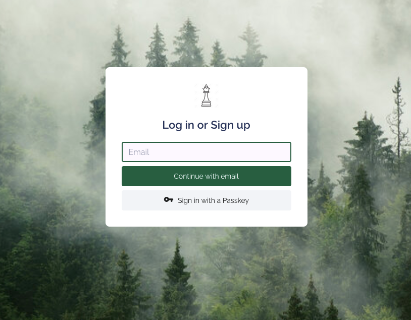
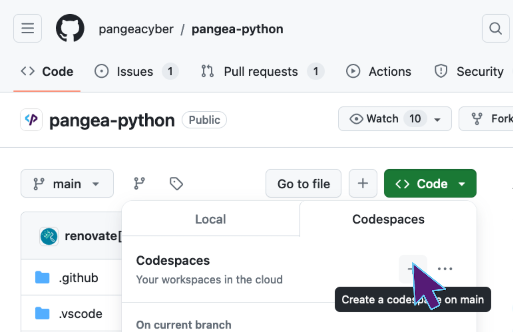
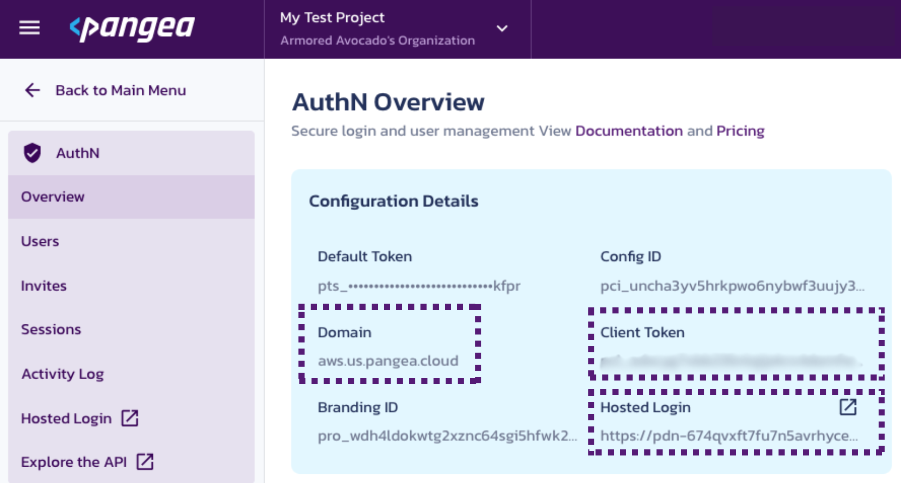
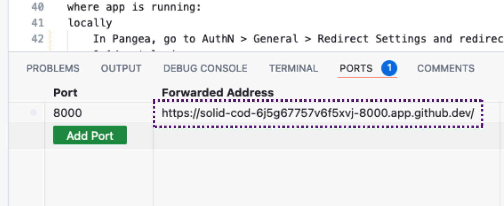
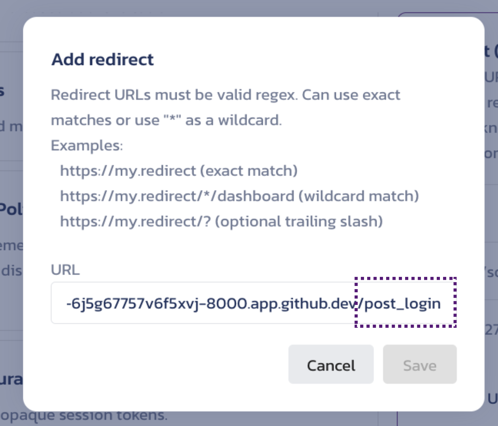

# Pangea Django Example
## Overview
This app demonstrates how to use the Pangea AuthN Django middleware in an application.  



## Pre Reqs Check
In order to run this application you are going to need:
 - [Pangea.Cloud](pangea.cloud) Account with AuhtN service enabled
 - Github account

There are two ways we will cover on how to run this example app: Codespace or locally. 

## Getting Started via Codespace
1. Create a Codespace in this repo

<br>
<br>

2. Once the codespace is up and running, change directories into this example app
```bash
cd examples/authn/django-authn/
```
<br>

3. Rename `.env.example` into `.env`
<br>
<br>

4. Fill out the tokens & values found in .env with the values found in the Pangea AuthN Overview page


<br>
<br>

5. Copy the Forwarded Address from the Ports Section of the terminal in the Codespace

<br>
<br>

> NOTE: This is the KEY difference between running in a codespace vs LOCALLY. 
> If you are running this locally, use the LOCAL address instead. It is probably https://127.0.0.1:8000

<br>
<br>

6. In Pangea go to `AuthN > General > Redirect` Settings and redirect to the copied Forward Address and add `/post_login` to the end. Make sure to hit save.


<br>
<br>

7. Go back to the Codespace and run the migrate command shown below.
```bash
python manage.py migrate
```
<br>

8. Finally, run the command below to  
```bash
python manage.py runserver
```
<br>

9. Head on over the address shown in your terminal to see your Authentication Page


